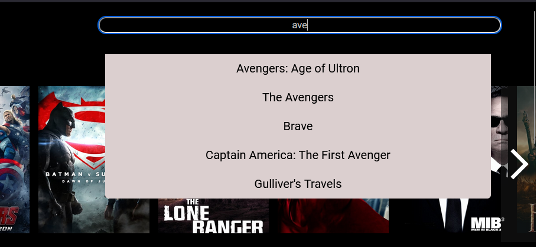
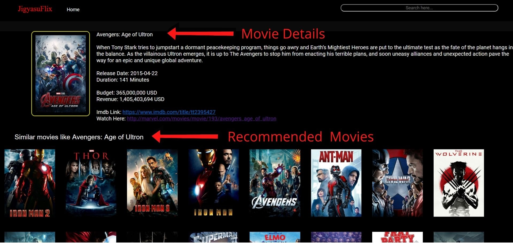

#screenshots in READMEs
# JigyasuFlix
## _The Movie Recommender_

JigyasuFlix is an easy-to-use movie recommender web application. All you need to do is search for a movie and it will show you a similar movie by using a variety of machine learning algorithms.

## How it looks?

### Homepage

### Search

### Movie Details and Recommendations

## How the recommendation engine works?
### [DATASET LINK](https://www.kaggle.com/datasets/tmdb/tmdb-movie-metadata?select=tmdb_5000_credits.csv)
Content-based filtering was used to recommend movies. Content-based filtering works on the principle that you will also like this other item if you like a particular item. 
* A cluster of words was formed using the overview, keyword, cast, and crew column of the dataset. Then stemming of words was done on the cluster using porterstemmer from python nltk library to get the root form of each word of the cluster. For example words like “retrieval”, “retrieved”, and “retrieves” reduce to their root form “retrieve”. Stop words of English like “is”, “of”, ”and” etc have also been removed for better results.
* The top 5000 most frequently occurred words from the cluster of words from all movies were extracted. They were then used for the construction of a 5000-dimensional vector of each movie. Each word was treated as a dimension and the frequency of that word in the movie became the length of the dimension. 
* Now, to find similar movies for a given movie, cosine distance was calculated between the vector of a particular movie and all other movie vectors. The closest vectors are the most similar movies for that particular movie. The movie recommender then picks the top 30 movies with the least cosine distances.

## How to install?

## Technologies Used

